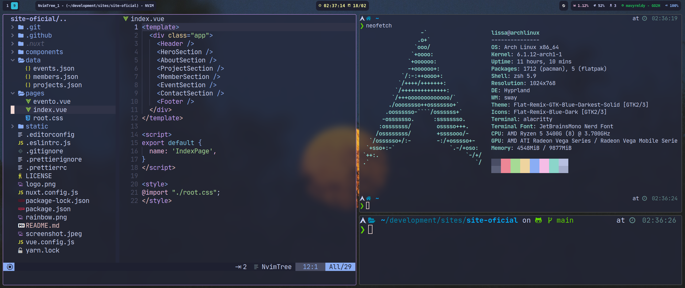
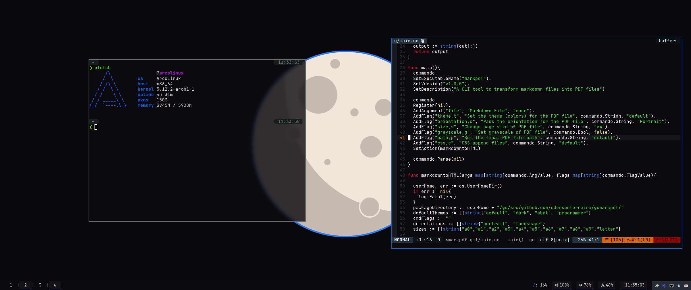

# Dotfiles

## OS

Arch Linux

## Hyprland (currently)

- WM: hyprland
- Bar: waybar
- App Launcher: rofi
- Notifications Manager: dunst
- Background Manager: swaybg
- Color Picker: hyprpicker
- Logout: wlogout
- Editor: LunarVim



## I3wm (past)

- WM: i3wm
- Bar: polybar
- App Launcher: dmenu
- Notifications Manager: dunst
- Background Manager: nitrogen



## Install

### Arch Linux

Clone the repository

```sh
git clone https://github.com/lissatransborda/dotfiles --depth 1
```

run `install-arch.sh` file

```
cd dotfiles/arch && ./install-arch.sh
```

### Ubuntu based distros

Clone the repository

```sh
git clone https://github.com/lissatransborda/dotfiles --depth 1
```

run `install-deb.sh` file

```
cd dotfiles/arch && ./install-deb.sh
```
