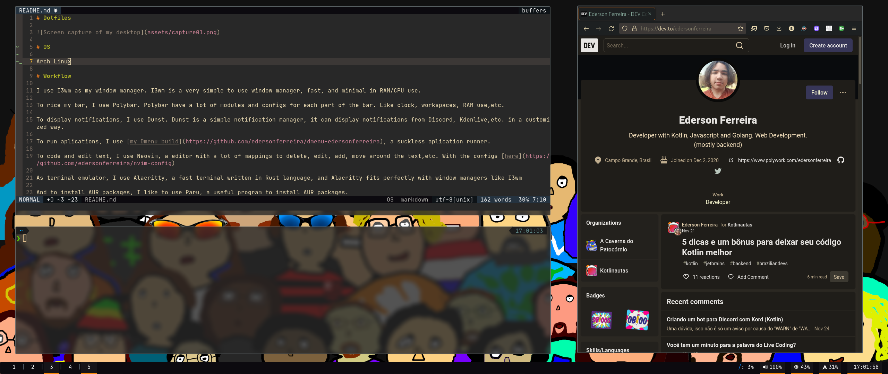

# Dotfiles

# Actual OS

ArcoLinux (Arch Linux based)

# Programs

- alacritty
- bat
- dunst
- feh
- firefox-nightly
- flameshot
- go
- i3-gaps
- lsd
- lxappearance
- lxsession
- neofetch
- neovim
- opendoas
- pavucontrol
- picom
- polybar
- ranger
- sl
- sxiv

# Workflow

I use I3wm as my window manager, because I3wm is a very simple window manager, with tabs layout (I love to use tabs).

To rice my bar, I use Polybar. Polybar have a lot of modules and configs for each part of the bar.

To display notifications, I like to use Dunst. Dunst is a simple notification manager, it can display notifications from Discord, Kdenlive,etc.

To run aplications, I use [my Dmenu build](https://github.com/edersonferreira/dmenu-edersonferreira), a suckless aplication runner.

To code and edit text, I use Neovim, a editor with a lot of mappings to delete, edit, add, move around the text,etc. With the configs [here](https://github.com/edersonferreira/nvim-config)

As terminal emulator, I like to use Alacritty, a fast termianal written in Rust language, and Alacritty fits perfectly with window managers like I3wm

And to install AUR packages, I like to use Paru, a useful program to install AUR packages, listing the packages from bottom to top, or top to bottom
